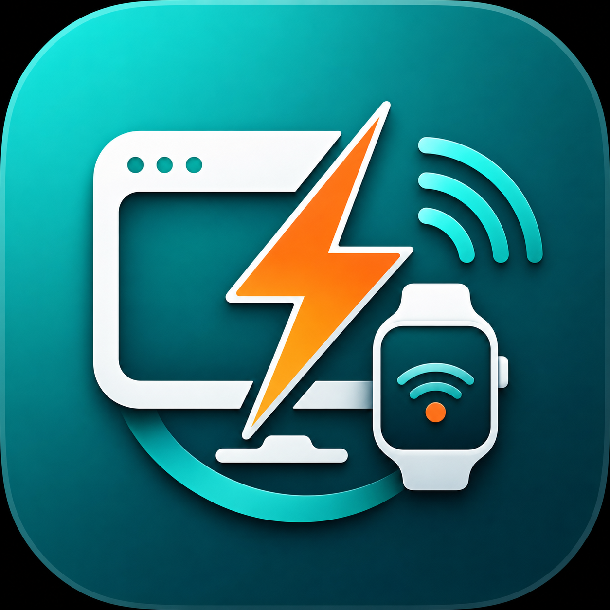
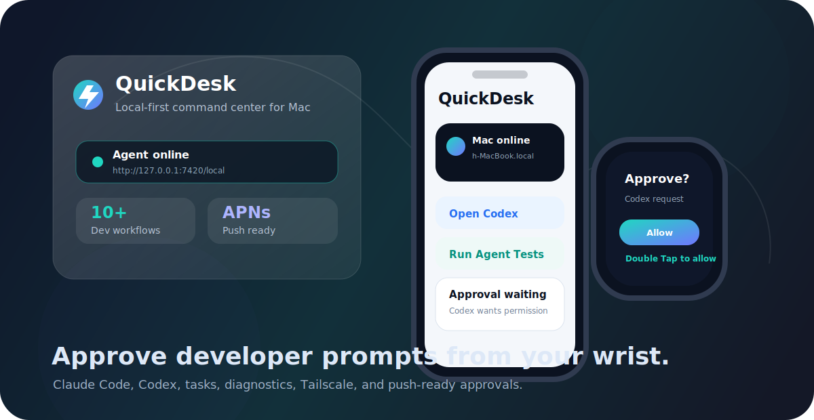
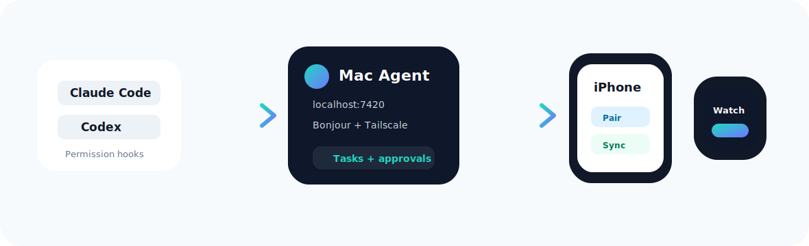
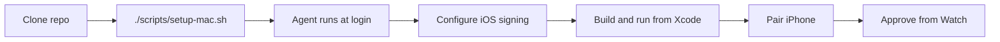

<p align="center">
  
</p>

<h1 align="center">QuickDesk</h1>

<p align="center">
  <strong>A local-first iPhone and Apple Watch command center for your Mac.</strong>
</p>

<p align="center">
  Run workflows, monitor your desktop agent, and approve Claude Code or Codex prompts from your phone or wrist.
</p>

<p align="center">
  
  
  
  
</p>

<p align="center">
  
</p>

## Why QuickDesk

QuickDesk gives your Mac a tiny local agent and turns your iPhone and Apple Watch into a fast developer remote. It is built for the moments where you are running agents, builds, tests, or AI coding tools and do not want to stay glued to the terminal just to approve one prompt.

| Use Case | What You Get |
|---|---|
| Claude Code and Codex approvals | Permission requests forwarded to iPhone and Apple Watch |
| Developer workflows | One-tap actions for Codex, Claude Code, Xcode, tests, builds, GitHub, Tailscale, and port cleanup |
| Apple Watch control | Approve or deny requests from the watch, including Double Tap / hand gesture support |
| Local network pairing | Bonjour discovery, automatic local pairing, and manual fallback |
| Remote access | Tailscale-friendly addresses and HTTPS tunnel support |
| Agent diagnostics | Uptime, memory, connected clients, push status, paired devices, and pending approvals |

<p align="center">
  
</p>

## Features

- iPhone SwiftUI app for pairing computers, launching tasks, managing diagnostics, and viewing approval prompts.
- Apple Watch SwiftUI app for quick workflows, approval cards, status, haptics, and Double Tap approval.
- Node.js desktop agent running on macOS as a per-user `launchd` service.
- Claude Code and Codex hook installers with safe backups.
- Local web control panel at `http://127.0.0.1:7420/local`.
- Developer Pack with useful default tasks.
- Optional Apple Push Notifications for true push delivery when the iPhone app is closed.
- Tailscale support for using QuickDesk away from your home Wi-Fi.

## Project Map

```text
QuickDesk/
├─ install.command            macOS one-step installer (double-click)
├─ desktop-agent/             TypeScript agent (cross-platform)
│  ├─ hooks/                  Claude Code and Codex approval hooks
│  ├─ scripts/                Hook installers and launch runner
│  ├─ src/                    Layered source: config, repositories, services, http, realtime
│  │  ├─ repositories/        Identity, tasks, logs persistence
│  │  ├─ services/            Executor (per-OS commands), pairing, approvals, push, diagnostics
│  │  └─ http/                Express app, middleware, routes, panel
│  ├─ ui/                     Vite + React + Tailwind desktop control panel
│  └─ dist/                   Compiled output (generated by `npm run build`)
├─ ios/
│  ├─ QuickDesk/              iPhone SwiftUI app
│  ├─ QuickDeskWatch/         Apple Watch SwiftUI app
│  └─ Shared/                 Shared models
├─ scripts/                   Setup (macOS + Windows), build, status, test approval
└─ docs/                      README visuals
```

## Requirements

| Requirement | Notes |
|---|---|
| macOS, Windows, or Linux | The desktop agent is cross-platform; it auto-detects the OS and runs the matching commands |
| Node.js 18+ | Used by the QuickDesk desktop agent |
| macOS + Xcode | Required only to build the iPhone/Apple Watch apps from source (iOS + watchOS SDKs) |
| iPhone + Apple Watch | Needed for the full mobile/watch experience |
| Apple Developer team | Required for real-device iOS/watchOS signing |
| Paid Apple Developer Program | Required only for APNs push notifications |

## Quick Start

### 1. Install the desktop agent (one step)

First clone the repo:

```bash
git clone https://github.com/barmor12/QuickDesk.git
cd QuickDesk
```

Then run the installer for your computer — it installs everything, builds the
agent and control panel, starts it automatically, and opens the dashboard.

**macOS** — double-click `install.command` in Finder, or run:

```bash
./install.command
```

**Windows** — right-click `scripts\setup-windows.ps1` → *Run with PowerShell*, or run:

```powershell
powershell -ExecutionPolicy Bypass -File scripts\setup-windows.ps1
```

That's it. The control panel opens at **http://127.0.0.1:7420/local**, where you
generate a pairing code (with QR), see paired devices, watch live activity, and
manage the agent. The agent restarts automatically at login.

### 2. Pair your iPhone

1. Open QuickDesk on the iPhone → `Computers` → `+`.
2. Pick your computer from nearby agents (or enter the code from the panel).
3. Tap `Pair`.

Send a test approval to confirm it reaches your watch:

```bash
./scripts/send-test-approval.sh
```

### 3. (Optional) Build the iPhone + Watch app from source

Only needed if you're building the mobile apps yourself (macOS + Xcode):

```bash
./scripts/configure-ios-signing.sh YOUR_TEAM_ID com.yourname.quickdesk
./scripts/build-ios-device.sh
open ios/QuickDesk.xcodeproj
```

In Xcode, select the `QuickDesk` scheme, choose your iPhone, and press Run.

## Install Flow



## Setup Scripts

| Command | Purpose |
|---|---|
| `./scripts/setup-mac.sh` | Installs dependencies, creates the launchd service, starts the agent, installs hooks, opens the panel |
| `./scripts/quickdesk-agent.sh status` | Shows launchd status and `/health` |
| `./scripts/quickdesk-agent.sh restart` | Restarts the background agent |
| `./scripts/quickdesk-agent.sh logs` | Follows agent logs |
| `./scripts/quickdesk-agent.sh panel` | Opens the local web panel |
| `./scripts/quickdesk-agent.sh uninstall` | Removes the launchd service, keeping user data |
| `./scripts/install-approval-hooks.sh` | Installs Claude Code and Codex hooks |
| `./scripts/install-approval-hooks.sh --remove` | Removes QuickDesk hooks |
| `./scripts/configure-ios-signing.sh TEAM_ID BUNDLE_ID` | Updates the Xcode project for another developer |
| `./scripts/build-ios-device.sh` | Builds the iPhone + Watch app for a physical device |
| `./scripts/send-test-approval.sh` | Creates a local test approval |

## Desktop Agent

The agent runs on port `7420` by default and advertises itself with Bonjour as `_quickdesk._tcp`.

Local panel:

```text
http://127.0.0.1:7420/local
```

Configuration:

```text
~/.quickdesk/agent.env
```

User data:

```text
~/.quickdesk/identity.json
~/.quickdesk/tasks.json
~/.quickdesk/logs.json
~/.quickdesk/agent.out.log
~/.quickdesk/agent.err.log
```

Disable automatic local pairing by editing:

```text
~/.quickdesk/agent.env
```

Set:

```bash
QUICKDESK_AUTO_PAIRING=0
```

Then restart:

```bash
./scripts/quickdesk-agent.sh restart
```

## iPhone and Apple Watch App

Every developer needs a unique Bundle ID. The helper script updates:

- iPhone bundle ID: `com.yourname.quickdesk`
- Watch bundle ID: `com.yourname.quickdesk.watchkitapp`
- Watch companion app bundle ID
- Xcode `DEVELOPMENT_TEAM`

Run:

```bash
./scripts/configure-ios-signing.sh YOUR_TEAM_ID com.yourname.quickdesk
./scripts/build-ios-device.sh
open ios/QuickDesk.xcodeproj
```

If Xcode stalls while attaching the watch debugger, let it finish the install once, then open QuickDesk directly from the watch app list.

## Developer Pack

Open QuickDesk on iPhone, go to `Agent`, then tap `Install Developer Pack`.

The pack adds or updates useful tasks:

| Task | Purpose |
|---|---|
| Open Codex | Opens Codex quickly from the Mac |
| Open Claude Code | Launches Claude Code |
| Open QuickDesk in Xcode | Opens the iOS project |
| Run Agent Tests | Runs `npm test` for the desktop agent |
| Build iPhone + Watch | Starts the Xcode build flow |
| Open GitHub Repo | Opens the repository |
| Open Agent Panel | Opens `http://127.0.0.1:7420/local` |
| Tailscale Status | Shows Tailscale connectivity |
| Free Dev Ports | Clears common local development ports |
| Developer Launchpad | Opens a focused developer workspace |

Tasks live in:

```text
~/.quickdesk/tasks.json
```

## Claude Code and Codex Approvals

Install both hooks:

```bash
./scripts/install-approval-hooks.sh
```

Remove both hooks:

```bash
./scripts/install-approval-hooks.sh --remove
```

Claude Code uses a `PreToolUse` hook. Codex uses a `PermissionRequest` hook. Each hook sends approval prompts to the local agent, waits for your decision from iPhone or Apple Watch, and returns that decision to the originating tool.

Codex must be configured to ask for approvals. If its approval policy is `never`, there is no prompt for QuickDesk to forward.

## Remote Use

Bonjour discovery and private LAN addresses work only when the iPhone and Mac are on the same network. For 5G or remote use, use Tailscale or an HTTPS tunnel.

### Tailscale

1. Install Tailscale on the Mac and iPhone.
2. Keep the QuickDesk agent running on the Mac.
3. Add the Mac in QuickDesk using its Tailscale IP or MagicDNS name.
4. Use port `7420`.

Examples:

```text
100.x.y.z
macbook-name.tailnet-name.ts.net
```

### HTTPS Tunnel

Expose the local agent through a trusted HTTPS tunnel, then add the full HTTPS URL in QuickDesk:

```text
https://quickdesk.example.com
```

Do not expose port `7420` directly to the public internet.

## Push Notifications

Without APNs, QuickDesk receives approvals through the live WebSocket connection while the iPhone app can reach the agent. It also pulls pending approvals when the app refreshes.

For true push notifications while the app is closed or the phone is away from Wi-Fi, configure APNs.

Apple setup:

1. Use a paid Apple Developer Program team.
2. Enable `Push Notifications` for your iPhone App ID.
3. Enable the `Push Notifications` capability on the QuickDesk iPhone target.
4. Regenerate or download a provisioning profile that includes `aps-environment`.
5. Rebuild and reinstall the app.
6. Create an APNs Auth Key (`.p8`) in Apple Developer.

Agent setup in `~/.quickdesk/agent.env`:

```bash
QUICKDESK_APNS_KEY_ID=ABC123DEFG
QUICKDESK_APNS_TEAM_ID=YOUR_TEAM_ID
QUICKDESK_APNS_KEY_PATH=$HOME/AuthKey_ABC123DEFG.p8
QUICKDESK_APNS_TOPIC=com.yourname.quickdesk
QUICKDESK_APNS_ENV=sandbox
```

Restart the agent:

```bash
./scripts/quickdesk-agent.sh restart
```

Use `sandbox` for Xcode development installs and `production` for TestFlight/App Store builds.

## Security Model

QuickDesk is designed for trusted personal devices and trusted networks.

| Area | Behavior |
|---|---|
| Pairing | Creates bearer tokens for paired clients |
| Hooks | Use a private machine-local token in `~/.quickdesk/identity.json` |
| Dangerous tasks | Shutdown and restart are blocked unless explicitly enabled |
| Network | Local-first by default; use Tailscale or HTTPS for remote access |
| Public internet | Direct public exposure of port `7420` is not recommended |

## Development

Run tests:

```bash
npm --prefix desktop-agent test
```

Build iOS/watchOS:

```bash
xcodebuild \
  -project ios/QuickDesk.xcodeproj \
  -scheme QuickDesk \
  -configuration Debug \
  -destination 'generic/platform=iOS' \
  build
```

Open the project:

```bash
open ios/QuickDesk.xcodeproj
```

## Troubleshooting

| Problem | Fix |
|---|---|
| iPhone cannot discover the Mac | Make sure both devices are on the same Wi-Fi, the agent is running, and Local Network permission is allowed |
| Works on Wi-Fi but not 5G | Use Tailscale or an HTTPS tunnel |
| ATS blocks `http://...` | Use the host field without `http://`, or use HTTPS for remote tunnel URLs |
| Watch app shows disconnected | Open the iPhone app once so it can sync state to the watch |
| No push notification | APNs requires a paid Apple Developer Program team and a push-enabled provisioning profile |
| Codex approvals do not appear | Make sure Codex is configured to ask for approvals and the hook is trusted |

## License

MIT
